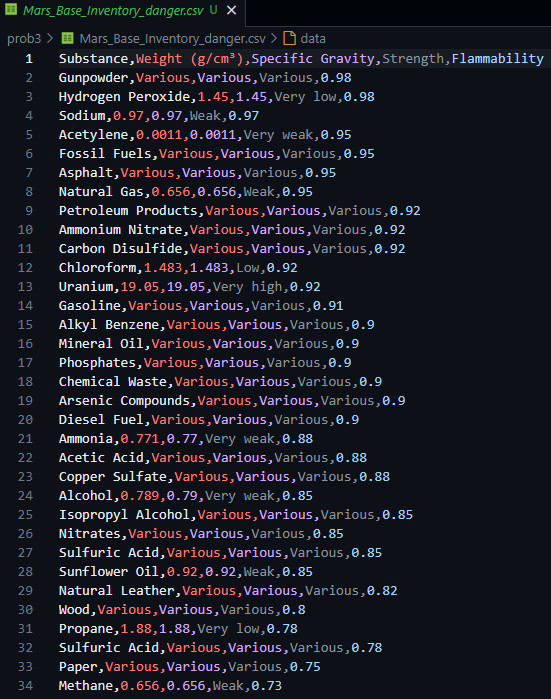
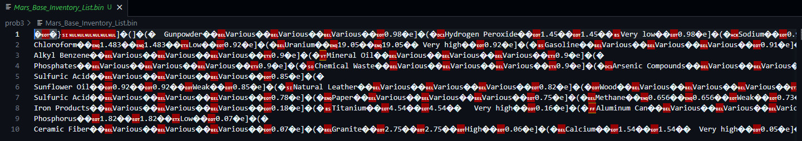

## 텍스트 파일 vs 이진 파일

### 1. 텍스트 파일

- 사람이 읽을 수 있는 형식 (문자, 숫자 등)
- 예: `.txt`, `.csv`, `.json`

---

### 2. 이진 파일

- 사람이 직접 읽기 어려움 (문자 대신 기호, 깨진 문자)
- 예: `.bin`, `.jpg`, `.exe`, `.pkl`

---

### 📌 차이점 요약

| 항목         | 텍스트 파일             | 이진 파일                         |
|--------------|--------------------------|------------------------------------|
| 읽기/수정    | 사람도 읽고 편집 가능    | 컴퓨터만 해석 가능                 |
| 용량         | 보통 큼 (공백, 문자포맷) | 보통 작음 (압축됨, 구조적 저장)   |
| 속도         | 느림 (파싱 필요)        | 빠름 (바로 읽고 씀)                |
| 구조 유연성  | 다양한 형식 가능        | 형식 고정됨 (틀 깨지면 로딩 실패) |

---

### ✅ 장단점 정리

#### 텍스트 파일

- ✔️ 사람이 직접 보고 수정 가능  
- ❌ 대량 데이터에 비효율적, 파싱 필요

#### 이진 파일

- ✔️ 속도 빠름, 저장 공간 절약  
- ❌ 사람이 보기 어렵고 수정 힘듦